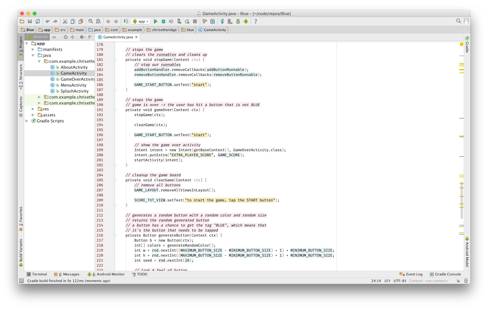

# Alabaster for Android Studio

### What?

This is the [alabaster skin](https://github.com/tonsky/alabaster-lighttable-skin) for Android Studio.

It's a good idea to use the [FiraCode](https://github.com/tonsky/FiraCode) font.

All credit goes to [@tonsky](https://github.com/tonsky)

### Installing

Place this file in `~/Library/Preferences/AndroidStudioX.X/colors/`.

The `X.X` would be whatever version you're currently running.

### Screenshot

